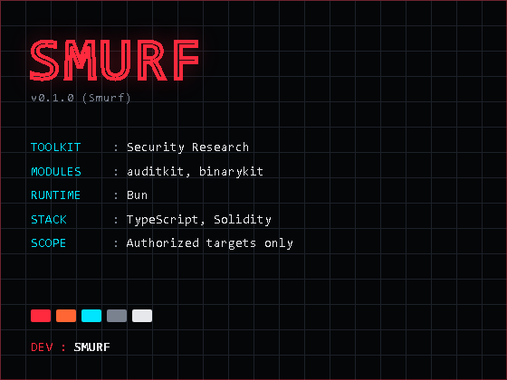

# 🛡️ Smurf Tool


A local security research toolkit: static/dynamic analysis for smart contracts and
binaries you own or are authorized to test. Two modules, one Bun/TypeScript codebase.



---

## 🚀 Modules

### 🔗 auditkit — Smart Contract Auditing

Solidity static analysis, fuzz-test scaffolding, and exploit PoC generation against
forked/local/testnet chains.

- **Static analysis:** custom detectors, cross-checked against Slither.
- **Fuzz scaffolding:** generates a Foundry fuzz-test harness for a target contract.
- **Exploit PoCs:** scaffolds exploit tests that fork chain state locally via Anvil.
- **Recon:** fetches verified source from a block explorer for a given address.
- **Reporting:** renders findings JSON as Markdown.

### 🔍 binarykit — Binary & Reverse Engineering

Static and sandboxed dynamic analysis for binaries you own or are authorized to inspect.
Observability-only — no patching, keygen, or protection-bypass generation.

- **Static analysis:** hashes, entropy, strings, and symbols.
- **Disassembly:** single-symbol disassembly via `objdump`.
- **Sandboxed dynamic analysis:** isolated execution with syscall/network logging
  (via `bubblewrap` + `strace`, Linux/WSL only). Network is isolated by default.
- **Reporting:** renders an inspect JSON as Markdown.

---

## 📋 Requirements

| Requirement | Needed for |
|---|---|
| [Bun](https://bun.sh) ≥ 1.1.0 | both modules |
| [Foundry](https://getfoundry.sh) (`forge`) | auditkit — fuzz/exploit scaffolds, in-place Slither runs |
| Python 3 + `slither-analyzer` + `solc-select` (optional) | auditkit — cross-checking findings against Slither |
| `objdump` | binarykit — `disasm` |
| `bubblewrap` + `strace` (Linux only) | binarykit — `sandbox` (run from WSL on Windows) |

---

## 🛠️ Installation

```bash
git clone https://github.com/SethDEV254/smurf-tool.git
cd smurf-tool

# Bun
npm install -g bun          # or: curl -fsSL https://bun.sh/install | bash

# Foundry (for auditkit)
curl -L https://foundry.paradigm.xyz | bash
foundryup
```

## ⚙️ Usage

```bash
cd Tools/auditkit
bun install
bun run src/cli.ts static contracts/YourContract.sol      # run detectors
bun run src/cli.ts fuzz contracts/YourContract.sol         # generate a Foundry fuzz scaffold
bun run src/cli.ts exploit -f <findingId> -o test/exploits # generate an exploit PoC scaffold
bun run src/cli.ts report findings/<file>.json             # render findings as Markdown
bun run src/cli.ts recon -a <address> -c <chain>           # fetch verified source
```

```bash
cd Tools/binarykit
bun install
bun run src/cli.ts inspect samples/target                  # hashes, entropy, strings, symbols
bun run src/cli.ts disasm samples/target -s main            # disassemble one symbol
bun run src/cli.ts report reports/<file>.json               # render an inspect JSON as Markdown
```

`contracts/`, `findings/`, `samples/`, and `reports/` are gitignored — working scratch
space, not tool source.

### Cross-checking with Slither (optional)

```bash
cd Tools/auditkit
python -m venv .venv-slither
./.venv-slither/Scripts/python.exe -m pip install slither-analyzer solc-select
./.venv-slither/Scripts/solc-select.exe install 0.8.20   # match your contract's pragma
./.venv-slither/Scripts/solc-select.exe use 0.8.20

export PATH="$PWD/.venv-slither/Scripts:$PATH"
slither contracts/YourContract.sol --json findings/slither-YourContract.json
```

### Sandbox (binarykit dynamic analysis)

Requires `bubblewrap` + `strace` — **Linux only**. On Windows, run from inside WSL.

```bash
wsl --install -d Ubuntu
wsl -d Ubuntu -u root -- bash -c "apt-get update && apt-get install -y bubblewrap strace unzip curl && curl -fsSL https://bun.sh/install | bash"

cd "/mnt/c/path/to/Tools/binarykit"
bun install
bun run src/cli.ts sandbox samples/target --args <arg1> <arg2> --timeout 15 --md reports/target-behavior.md
# pass --allow-network to permit DNS/outbound connections (isolated by default)
```

---

## ⚠️ Scope & Legal

For analyzing contracts/binaries you own or are authorized to test. `binarykit` is
observability-only. `auditkit`'s exploit PoCs fork chain state locally via Anvil — point
them only at contracts you're authorized to test.

---

## 👥 Credits

**Dev:** [SMURF](https://github.com/SethDEV254)
